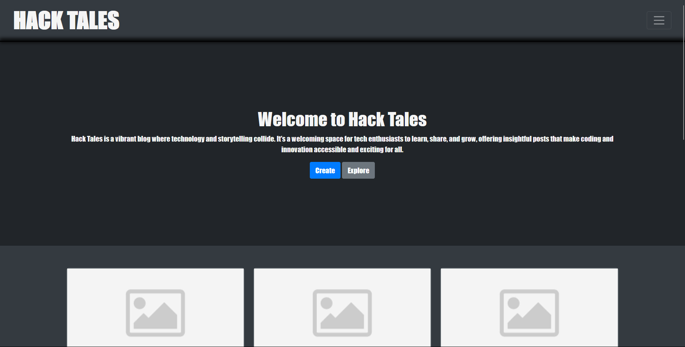
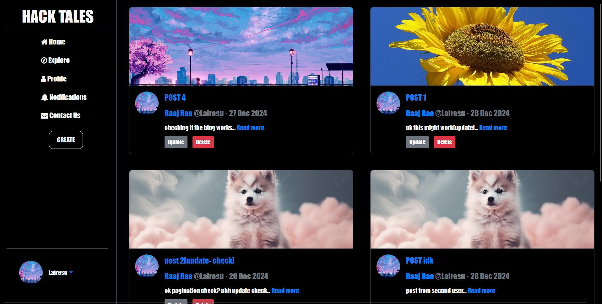

# Blog App

A simple and intuitive blog application built using modern web technologies. This application allows users to create, read, update, and delete blog posts, manage user accounts, and engage with content.

---

## Features

- 📝 **Create, Edit, and Delete Posts**: Users can manage their blog posts easily.
- 🔍 **View Blogs**: Browse and read blog posts with an elegant user interface.
- 👥 **User Authentication**: Sign up, log in, and log out functionality.
- 🏷️ **Categories and Tags**: Organize blog posts for better navigation.
- 📱 **Responsive Design**: Works seamlessly on mobile, tablet, and desktop devices.

---

## Technologies Used

- **Backend**: 
  - Python 3.12.8
  - Flask 
- **Frontend**:
  - HTML5
  - CSS3
  - Bootstrap 5
  - JavaScript (ES6+)
- **Database**:
  - PostgreSQL
- **Other Tools**:
  - Git & GitHub for version control

---

## Setup Instructions

1. **Clone the Repository**:
   ```bash
   git clone https://github.com/Lairesu/Blog-App.git

   cd blog-app
   ```

2. **Create a Virtual Environment**:
   ```bash
   python -m venv env
   source env/bin/activate  # Linux/Mac
   env\Scripts\activate     # Windows
   ```

3. **Install Dependencies**:
   ```bash
   pip install -r requirements.txt
   ```

4. **Run the Application**:
   ```bash
   python "run.py"
   flask run                  # For Flask
   ```

5. **Access the Application**:
   Open your browser and navigate to `http://127.0.0.1:5000`.

---

## Screenshots

### Home Page
<p align="center">
  
</p>

### Blog Post Page
<p align="center">
  
</p>
---

## Future Enhancements

- **N/a** as of right now

---

## License

This project is licensed under the MIT License. See the [LICENSE](LICENSE) file for details.

